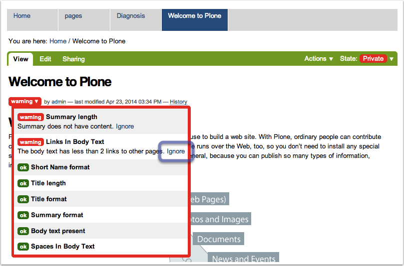
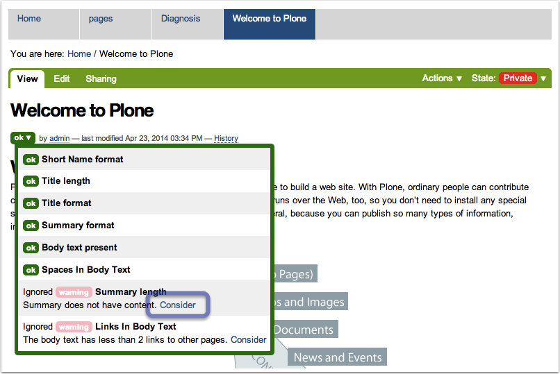
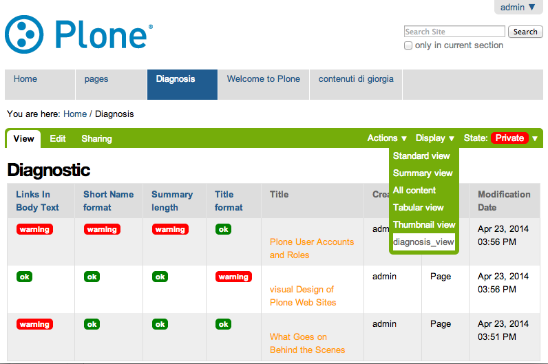
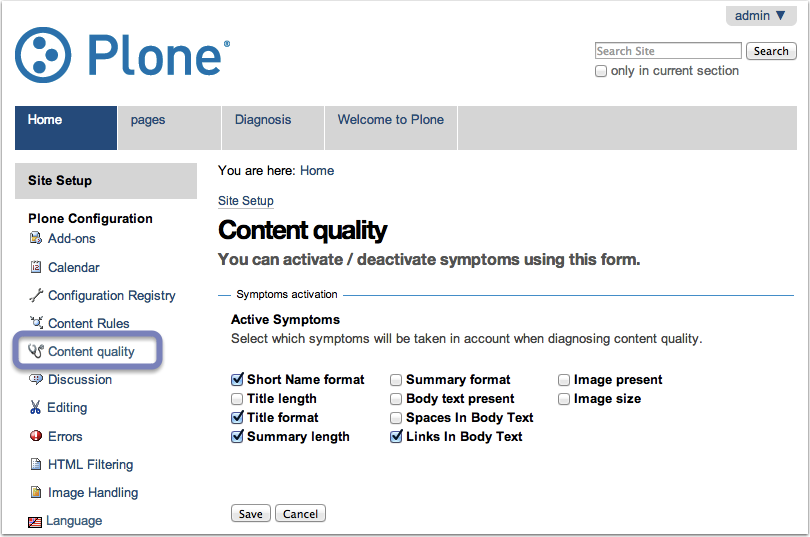

What is collective.jekyll
=========================

Collective.jekyll provides editors and site administrators with an easy tool to monitor and improve the quality of managed contents.

Sort of troubles you prevent with Jekyll:

	Does the title of the news start with a capital letter?

	Has the editor remembered to add an image in the right format?

Jekyll has been developed to improve the content quality of your website monitoring a number of critical "symptoms" such as:

- short name, title and summary formats,
- title, summary and body text length,
- presence of useless spaces in the body text,
- presence of a minimum number of internal links in the body text,
- image presence and size

How it works
============

Every time an editor saves a content, a menu with all the syntoms checked will be displayed at the begin of the byline under the title.
A *warning* message in red will be shown on the side of each problem detected.

Dealing with warnings
=====================

Clicking on the *warning* message, the editor will be shown a longer description suggesting the way to edit and fix the detected errors. 
Clicking on "Ignore", instead, the editor will exclude the monitoring of that syntom, but only in that specific context.

Diagnosis view for collections
==============================

Jekyll provides website reviewers and editors with an additional tool to monitor the quality of content. You can create a collection listing the contents to monitor (e.g. all the "news item" content, all the contents created by a specific editor, all the contents with a certain tag, ...). 
Jekyll provides a ``diagnosis_view`` that you can select from the `Display menu`. With this view on, you will have a clear idea on the quality of contents listed by the collection.

How to set up Jekyll
====================
Once Jekyll has been installed, you can select the symptoms you want to check. To do this, go to the `site control panel` and choose the "content quality" option. 
To add a symptom just tick on it on the show list.

